## Hi there 👋

  

Hi, I'm Vinith — a B.Tech AI & Data Science student building my way toward SDE and AI roles. I work on AI-powered projects, explore LLMs, and solve DSA problems for fun (600+ on LeetCode and counting). I learn best by building, breaking, and fixing things. Still learning, still shipping. 🚀

## ⚡ Tech Arsenal

  

